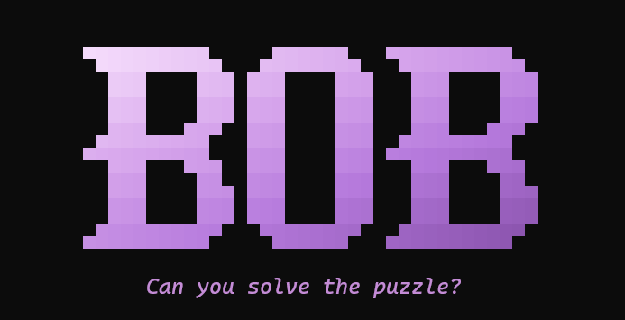

  

# Bob Roadmap

Where Bob is today and where it's going. This is the product level view. The exact pinned build each
release ships is in [`versions.lock`](versions.lock), and the release by release detail is in
[`CHANGELOG.md`](CHANGELOG.md).

## Versioning

Bob follows [semantic versioning](https://semver.org): `MAJOR.MINOR.PATCH`.

- **MAJOR**: a change to what Bob *is*, such as a new supported platform class, a new operating mode, or
  a breaking change to the install, config, or API surface.
- **MINOR**: new capabilities that don't break existing setups (models, tools, agent features).
- **PATCH**: fixes and hardening, with no new surface.

Every release is reproducible. [`versions.lock`](versions.lock) pins the submodule commits, the per-venv
dependency locks, the minimum toolchain, and the model manifest (repo, revision, sha256). `bob version`
reports the running release. `bob update` moves between releases lockfile to lockfile, rebuilds only what
changed, verifies, and rolls back on failure.

> **1.0 is the current line.** Bob started as a Windows first, two language (PowerShell plus Python)
> experiment. That whole plan is now complete: one command, one engine, cross platform, reproducible, and
> test backed. 1.0 marks the point where Bob is a coherent product rather than a build out. Everything
> below 1.0 is history; everything above it is the plan.

---

## 1.0 today: a private, local first AI that chats, sees, speaks, and codes

The complete picture of what Bob does now. Everything here is shipped and covered by the test suite, and
the cross OS CI acceptance gate runs on every PR.

### Talk to it, one front door
- A single `bob` command opens an interactive shell: streamed replies, Ctrl-C to cancel, and a slash
  command cockpit (`/agent`, `/voice`, `/model`, `/up`, `/services`, `/stop`, `/logs`, `/session`,
  `/skill`).
- Every capability is also a direct command for scripts and pipes (`bob chat`, `bob agent`, `bob voice`,
  `bob describe`, `bob remember`, and more), and any single tool can run headless with
  `bob --run <tool> '{json}'`.
- Inference auto starts on demand, so there is nothing to launch first.

### Local inference, cloud on demand
- llama.cpp built from source (CUDA), hot swapped by llama-swap, behind an OpenAI compatible LiteLLM
  proxy. Any tool pointed at OpenAI works by changing one base URL.
- VRAM profiles from 8 GB to 32 GB, auto selected from the detected GPU, plus a CPU tier for GPU-less
  machines.
- Named roles (chat, coder, ponder, vision, embed, fim, agent) with optional cloud "pro" peers
  (DeepSeek, GLM) routed transparently when you ask for them.

### An agent that acts, safely
- A full tool using agent loop: memory, web, git, file, shell, and fabric tools plus drop-in plugins.
- Sub agents and delegation, parallel tool execution, context compaction (summarize, don't drop), and
  planning, reflection, and self repair.
- Safety by construction: an OS level sandbox (Linux namespaces and seccomp, Windows job objects),
  granular per tool and per owner permissions (`allow`, `ask`, `deny`, audited), owner scoped sessions, an
  auth token store with RBAC, and OpenTelemetry tracing into Langfuse.
- Speaks MCP both ways. It mounts external MCP servers' tools, and exposes its own tools over MCP.

### A real coding agent
- Repo map and symbol index, plus fast ripgrep based code search for code aware retrieval.
- Structured edits: search and replace, and unified diff patches, rather than whole file rewrites.
- A lint plus run tests and fix loop, a filesystem guard, per step checkpoint and rewind, and a diff
  preview before edits land.

### Durable, long horizon autonomy
- Resumable runs. A task checkpoints its state and survives a restart or crash.
- Detached background tasks (`bob task start|status|logs|resume|cancel|rewind`) that keep running after
  you disconnect.
- Computer use (opt in, off by default): screenshot plus mouse and keyboard, every action approval gated,
  running against a virtual display, with a kill switch and an append only audit. It is never available to
  an unattended task without an explicit opt in.

### Sees and speaks
- Vision in the loop: the agent can be handed an image mid task and reason over it. `bob describe` and
  `bob screenshot` cover one shots.
- Voice: a spoken conversation mode in the shell (`/voice`) and `bob voice`, with Whisper STT in and Piper
  TTS out.

### Remembers you
- Typed memory (profile, preference, project, fact, episodic) in SQLite with BGE-M3 embeddings.
- Blended recall (semantic, recency, importance), pin and unpin, per project scoping, human editable
  `BOB.md` and `AGENTS.md`, conflict aware consolidation, and provenance.
- Context engineering: reranking, self editing memory blocks, and conversation paging.

### Fits your existing tools
- Open WebUI, Continue.dev, Cline, aider, fabric (254 patterns), n8n, SearXNG, Langfuse, and Qdrant, all
  wired to the local endpoint by setup.

### Runs where you run
- Linux (apt, dnf, pacman, zypper, including atomic Fedora via rpm-ostree) and Windows 11, on NVIDIA CUDA
  or the CPU tier.
- One engine, zero PowerShell: a pure Python runtime, provisioning, and CI.
- Reproducible installs and a `bob update` that rolls back on failure, `bob doctor` for health, and a
  fresh install CI acceptance matrix on both operating systems every PR.

---

## What's next

Each line below is grounded in where local AI and coding agents actually are in 2026 (sources at the
bottom). Version numbers are targets, not commitments; scope moves between them as things land.

### 1.1 easy to install and get started
Lower the barrier to entry so a new machine goes from nothing to a working Bob in one step, and a normal
install never trips over Docker.

- **One command install.** A hosted install script that replaces the clone plus two script dance with a
  single line per OS: `curl -fsSL https://get.bob.sh | sh` on Linux and macOS, and
  `irm https://get.bob.sh/install.ps1 | iex` on Windows. The script clones (with submodules), runs the
  prereq and setup steps, verifies against `versions.lock`, and is idempotent on re run. Linux and Windows
  ship first; the macOS path arrives with macOS support in 2.0 (see below).
- **A Docker-free default install.** Nothing in Bob's core needs Docker; only three optional add-on
  services do, and setup doesn't install Docker, so a default install can't reach them today. Make the two
  that can run native do so out of the box: SearXNG (private search) in a venv, and n8n (workflow builder)
  on the Node toolchain setup already installs. That leaves only Langfuse (observability), which ships
  container-only, as an explicit Docker opt-in, and for the Docker-averse we point Bob's existing
  OpenTelemetry traces at a lighter native sink instead. When you do opt into Langfuse, Bob makes Docker
  painless: a guided install through the same package-manager seam setup already uses, then a single
  command that brings up Langfuse and its Postgres from the pinned compose file, with clear steps to reach
  the dashboard. Web search already falls back to a direct provider when SearXNG is down, so it never
  requires Docker either. The goal: a normal install never trips over Docker, and Docker becomes something
  you choose (and are walked through) only for the Langfuse dashboard.
- **Onboarding and entry clarity.** Finish the first run polish (the "it doesn't know me yet" case) and
  make the single entry point unmistakable for a new user.

### 1.2 sharper daily driver
Refresh what's already here so it keeps pace, and close the rough edges from real use.

- **Model refresh.** Move the coder role off the older Qwen2.5-Coder-14B to a current Qwen3-Coder
  (30B-A3B or 27B class) that fits a single workstation at roughly 96% of flagship quality, and refresh
  the cloud peers (DeepSeek V3.2, GLM-4.6, and Kimi K2 for multi attempt agentic coding).
- **Faster, tougher voice.** Swap the STT path to a CTranslate2 or faster-whisper backend (about 4 to 5
  times faster, and lighter on memory) and harden the voice loop against device and engine failure.

### 1.3 a deeper coding agent
Take the coding loop from good to measured best in class for a local harness.

- **Structural code retrieval.** Add an `ast-grep` escalation tier and tree-sitter symbol extraction on
  top of today's ripgrep and repo map. The 2026 evidence is clear: structure aware, agent driven search
  beats vector RAG for code. This is the stack Claude Code, Cursor, and Devin converged on.
- **Self scoring in CI.** Run a SWE-bench Verified subset and Terminal-Bench 2.1 against Bob's own harness
  on release tags, and track the score across versions, so "did this release get better at coding?" has a
  number.
- **Workflow orchestration.** A plan as code layer that fans work out across many sub agents in one
  session, where the plan lives in executable control flow rather than the model's context window.
- **Lifecycle hooks.** Expose scriptable events around the agent loop (pre and post tool, session start
  and end) so users can customize behavior without forking the harness.

### 1.4 more model on the same GPU
Push the inference tier so bigger, better models run on the hardware people already own.

- **MoE expert offload.** Adopt llama.cpp's `-n-cpu-moe` (which now exists; an earlier internal note that
  it didn't is stale) to keep MoE experts in system RAM and run an 80B-A3B class coder on a 16 GB card.
- **Better speculative decoding.** MTP and self speculative decoding for MoE models, where the wins are
  now real rather than a mixed bag.
- **CPU tier backend option.** Offer the `ik_llama.cpp` fork for the no-GPU tier, which is meaningfully
  faster on CPU and DDR5.
- **Streaming, low latency voice.** Parakeet-TDT or Moonshine for sub second streaming STT with VAD, so
  the voice loop feels conversational.

### 2.0 everywhere, and together
The big leaps that change what Bob *is*, which is why they carry a major version.

- **New platforms.** macOS (a Metal backend) and AMD ROCm, today's honest "not yet" rows on the support
  matrix. This is also what completes the one command installer (1.1) across all three OSes: once macOS is
  a supported platform, `curl -fsSL https://get.bob.sh | sh` covers it too.
- **Team mode.** The agent server is already owner scoped with RBAC. Productize it into a shared, multi
  user Bob with per owner memory scopes.
- **Reach your Bob from anywhere.** A secure path to your own agent server from a phone or another
  machine, without exposing it to the open internet.

### Backlog: good ideas, not yet scheduled
- On device fine tuning and personalization of a small local model on your own corrections.
- A richer plugin and skill marketplace beyond the built-in set.
- Cost and latency aware routing that picks local versus cloud per request automatically.

---

## Sources for the "what's next" research

- Open weight coding model landscape (Qwen3-Coder, DeepSeek V3.2, GLM-4.6, Kimi K2, SWE-bench):
  [Kilo](https://kilo.ai/open-source-models),
  [MindStudio](https://www.mindstudio.ai/blog/best-open-source-llms-agentic-coding-2026),
  [RunLocalModel](https://runlocalmodel.com/best-local-coding-llm-2026.html)
- Agentic code retrieval beats vector RAG (ripgrep, ast-grep, tree-sitter, repo map):
  [MindStudio](https://www.mindstudio.ai/blog/is-rag-dead-what-ai-agents-use-instead),
  [dev.to](https://dev.to/nimay_04/rag-is-not-always-the-answer-anymore-how-ai-agents-search-code-in-2026-43m3),
  [ceaksan](https://ceaksan.com/en/code-search-for-ai-agents-which-tool-when)
- Harness engineering, sub agents, dynamic workflows, Terminal-Bench:
  [AddyOsmani](https://addyosmani.com/blog/agent-harness-engineering/),
  [State of CLI Coding Agents, Mid-2026](https://blog.arcbjorn.com/state-of-cli-coding-agents-2026),
  [Building Effective AI Coding Agents for the Terminal (arXiv)](https://arxiv.org/abs/2603.05344)
- Inference: MoE CPU offload, speculative decoding, quant kernels:
  [ik_llama.cpp](https://github.com/ikawrakow/ik_llama.cpp),
  [n-cpu-moe performance](https://partnerinai.com/blogs/llamacpp-n-cpu-moe-performance-why-speedups-happen),
  [DFlash and when spec decoding helps](https://allenkuo.medium.com/when-speculative-decoding-helps-local-llms-and-when-it-doesnt-5c41dd804e4b)
- Local STT and TTS (faster-whisper, Parakeet, Moonshine, Piper):
  [Northflank](https://northflank.com/blog/best-open-source-speech-to-text-stt-model-in-2026-benchmarks),
  [onResonant](https://www.onresonant.com/resources/local-stt-models-2026),
  [PromptQuorum](https://www.promptquorum.com/power-local-llm/local-whisper-stt-comparison-2026)
